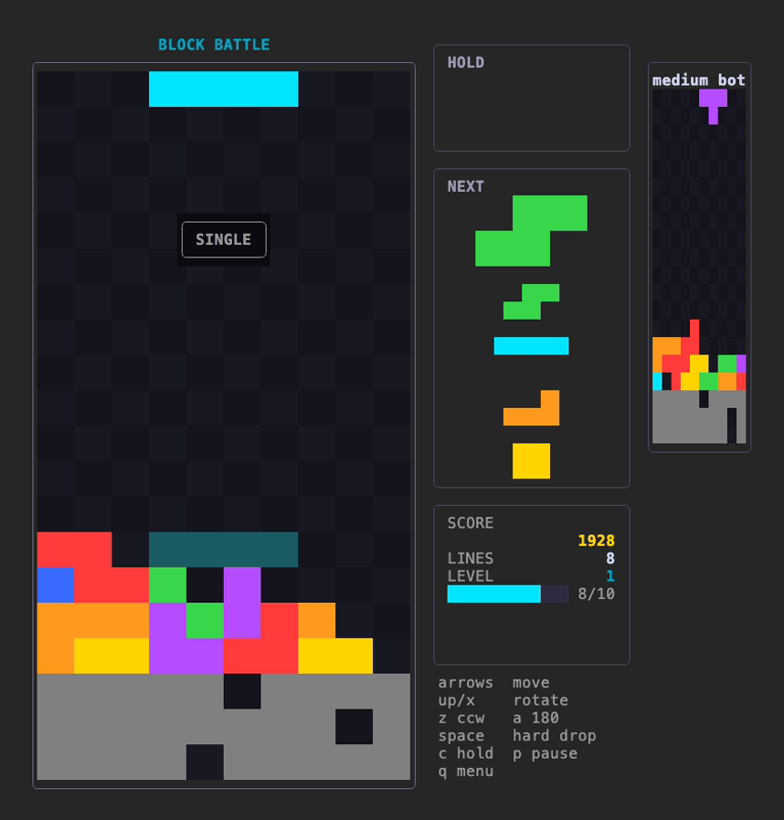
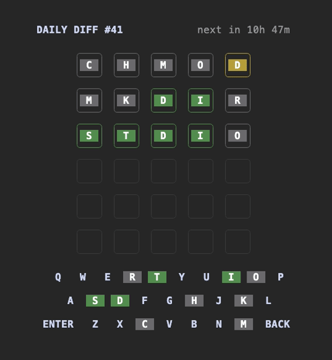
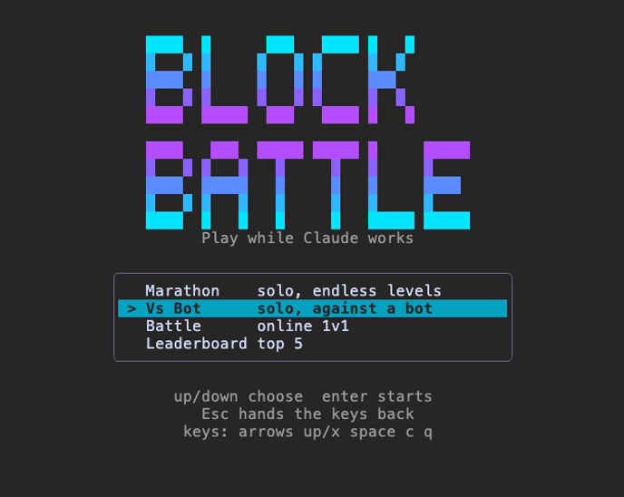
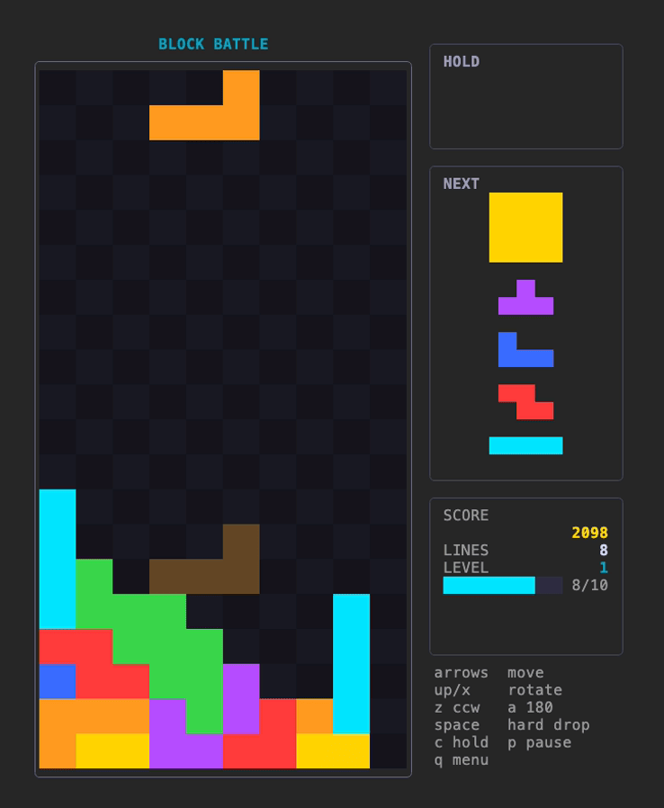
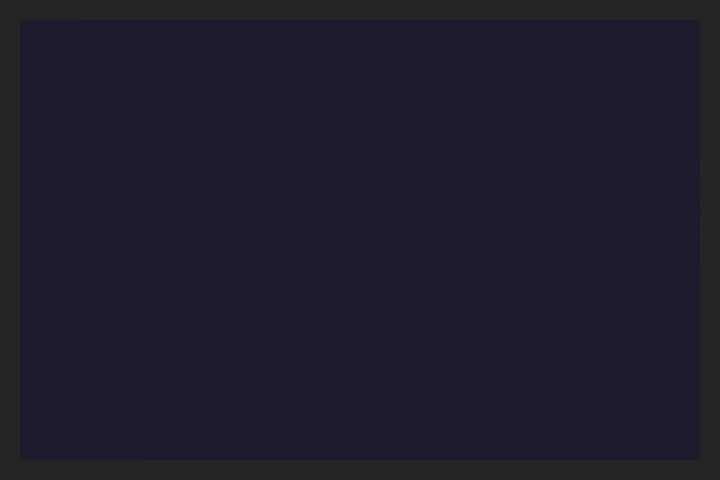
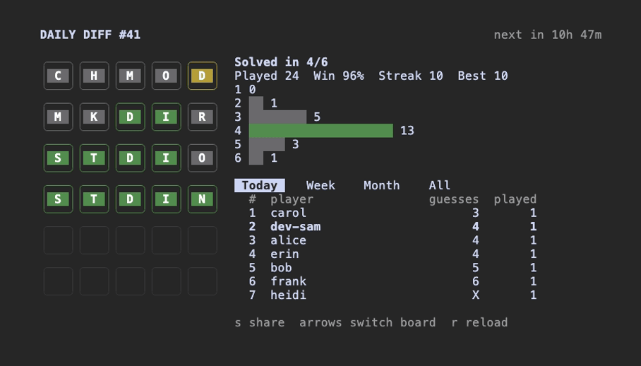

# claude-games

Games to play inside [Claude Code](https://code.claude.com) while it works on something long: a falling-block game with online battles, and a daily coding word puzzle.

They run as Claude Code mods.

<p>
  
  
</p>

## Install

You need Claude Code 2.1.291 or later. Games show up in the terminal and in the Code tab of Claude Desktop. They don't show in cloud sessions, in the VS Code chat panel, or with `claude -p`.

In a Claude Code session:

```
/plugin install block-battle --marketplace jpo-oss/claude-games
/plugin install daily-diff --marketplace jpo-oss/claude-games
```

Install one or both.

Claude Code shows what the game adds and asks where to install it. Pick "Install for you" to have it in every project on this machine. If the command doesn't show up right away, run `/reload-plugins` or start a new session.

If you'd rather add the marketplace once and pick games from it:

```
/plugin marketplace add jpo-oss/claude-games
/plugin install block-battle@claude-games
/plugin install daily-diff@claude-games
```

In the desktop app you can also click **+** next to the prompt box, then **Plugins**, then **Add plugin**, once the marketplace is added.

### Updates

Auto-update is off by default for this marketplace. Turn it on with `/plugin`, **Marketplaces**, claude-games, **Enable auto-update**. Or update by hand:

```
claude plugin update block-battle@claude-games
claude plugin update daily-diff@claude-games
```

If a game says it's out of date, the server has moved on and you need the update to keep playing online.

### Uninstalling

```
claude plugin uninstall block-battle@claude-games
claude plugin uninstall daily-diff@claude-games
```

## Games

### Block Battle

A falling-block puzzle. Play solo Marathon, beat a bot at three levels, battle other players 1v1, and climb the leaderboard.

<p>
  
  
</p>

Run `/cg-block-battle` and click the pane to start. Left and right move, down drops faster, space drops all the way. Up or x rotates, z rotates the other way, a flips, c holds. p pauses Marathon, q goes back to the menu, Esc leaves the pane.

Marathon works offline, but a game only counts for the leaderboard if you were signed in when it started. Otherwise it says "unranked" at the end. Battles and the leaderboard need a one-time GitHub sign-in: the game shows a code, you enter it at github.com/login/device, and that's it. The sign-in asks for no permissions, so the server only learns your public username. The game keeps a key for that server and never stores your GitHub token.

Vs Bot puts you against a bot that runs on your machine, so it plays offline too. Pick Merge Conflict (easy), Hotfix in Prod (medium) or Deploy on Friday (hard). If you were signed in when the match started, a win counts toward that level's fastest wins on the leaderboard's second page (left and right switch pages). Leaving a ranked match with q counts as a loss.

To sign out of the server you're on:

```
/cg-block-battle signout
```

#### Choosing a server

When you pick Battle, the game asks where to play: the official server, or a server address you type in. It remembers the last address you typed. Servers other than the official one are run by someone else, and the game says so before you sign in to one.

Each server has its own players and leaderboard. Signing in to one server doesn't sign you in to another, and your sign-in for one is never sent to another.

Want to run your own? See [claude-games-server](https://github.com/jpo-oss/claude-games-server).

### Daily Diff

A daily five-letter coding word puzzle. Everyone gets the same word each day and has six guesses. Streaks and a leaderboard keep score.





Run `/cg-daily-diff` and click the pane to start. Type a word and press Enter. Green is the right letter in the right spot, yellow is in the word somewhere else, gray isn't in the word. A new puzzle starts at 00:00 UTC, and a game you haven't finished by then counts as a loss.

When you finish you see the answer, your streak and how many guesses your wins usually take, plus the top 20 for today, this week, this month and all time. Press s to copy a spoiler-free result to paste in chat.

Playing needs a one-time GitHub sign-in, the same kind as Block Battle with no permissions asked. Each game keeps its own sign-in, so Daily Diff asks once even if you already signed in to Block Battle. To sign out:

```
/cg-daily-diff signout
```

## A note on trust

Mods aren't sandboxed. They run with your permissions, like any plugin. Read the code before you install, which is part of why this is open source. See the [privacy policy](PRIVACY.md) for what the official server keeps.

## Contributing

See [CONTRIBUTING.md](CONTRIBUTING.md). Security issues go through [SECURITY.md](SECURITY.md).

## License

[MIT](LICENSE)
